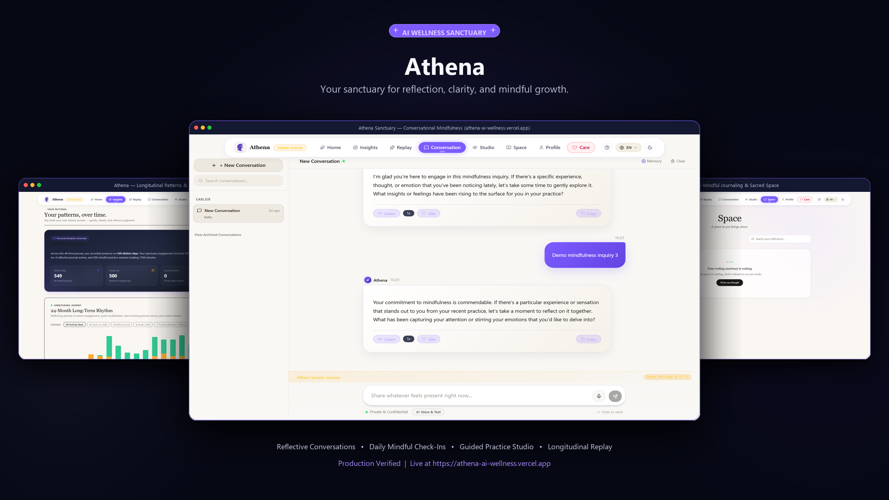
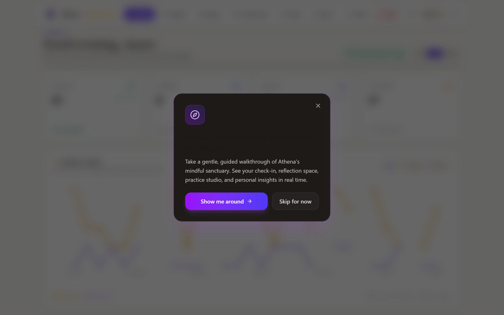
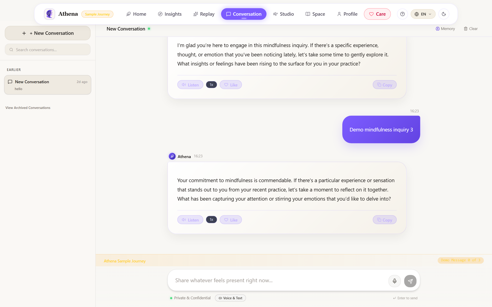
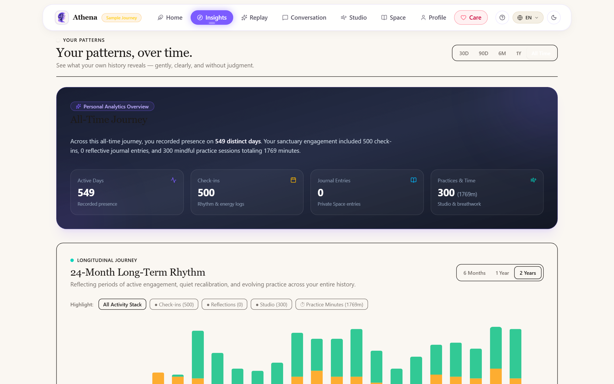
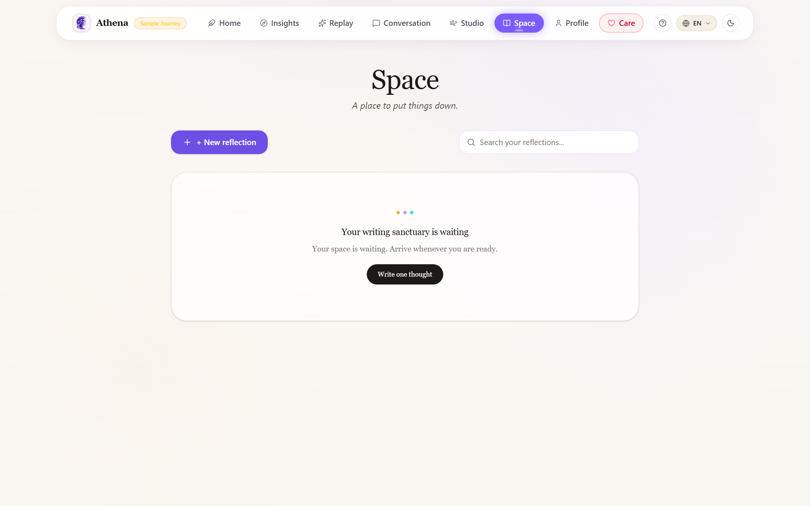
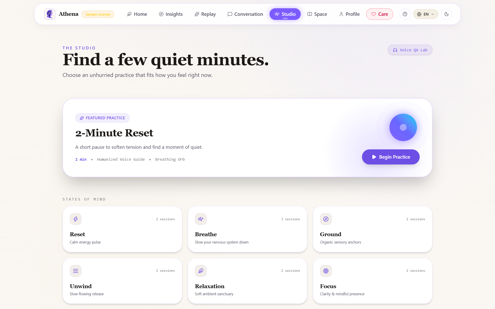
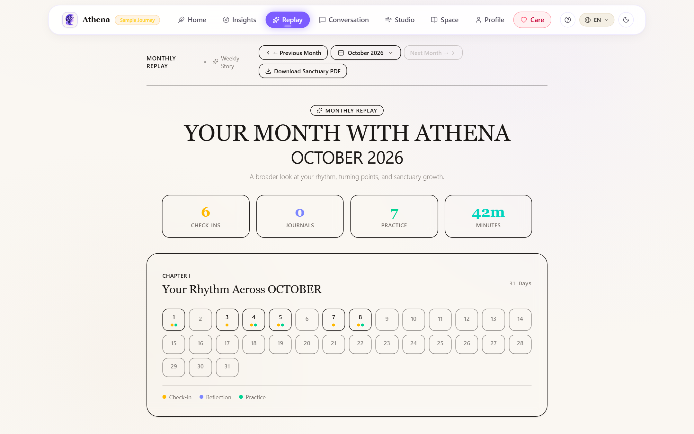
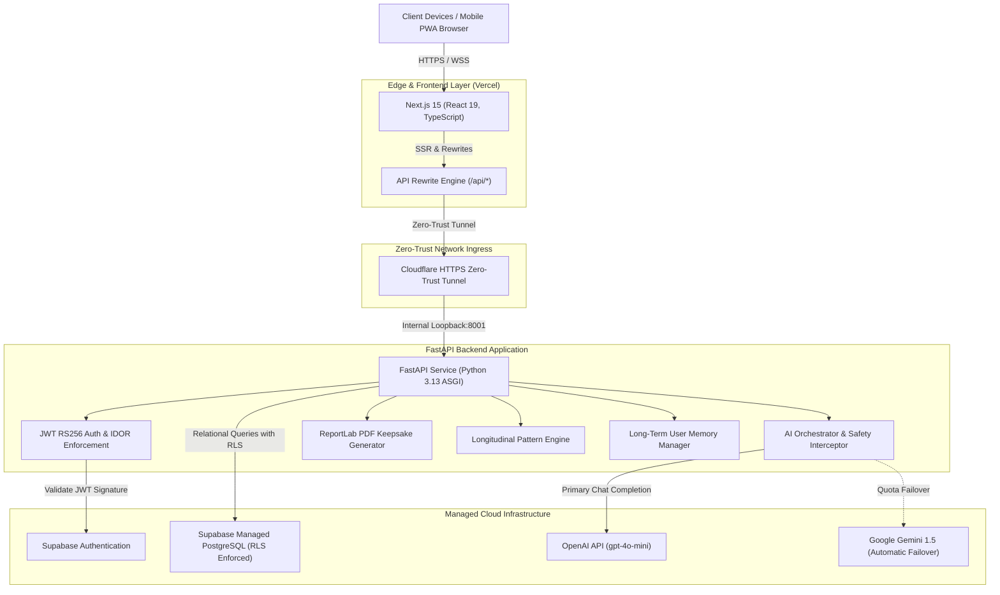

<p align="center">
  
</p>

# Athena

<p align="center">
  <strong>Your sanctuary for reflection, clarity, and mindful growth.</strong>
</p>

<p align="center">
  <a href="https://athena-ai-wellness.vercel.app"></a>
  <a href="https://nextjs.org/"></a>
  <a href="https://fastapi.tiangolo.com/"></a>
  <a href="https://supabase.com/"></a>
  <a href="https://www.typescriptlang.org/"></a>
  <a href="https://www.python.org/"></a>
</p>

---

## Product Showcase

<p align="center">
  
</p>

---

## 1. Product Introduction

**Athena** is an AI-powered wellness sanctuary engineered to create an intentional space between stimulus and response. In high-stress, fast-paced modern environments, emotional fatigue and cognitive clutter accumulate unchecked. Athena provides a calm, private digital sanctuary where individuals engage in continuous self-reflection, build grounding daily habits, journal with AI-assisted clarity, practice somatic breathwork, and observe longitudinal patterns across their personal emotional history.

Coupling an empathetic, safety-calibrated AI orchestrator with rigorous data isolation and edge delivery, Athena empowers members to cultivate emotional resilience, illuminate thinking patterns, and mark meaningful milestones over months and years of practice.

> [!NOTE]
> **Safety & Medical Scope**: Athena is a mindfulness, reflection, and wellness companion. Athena is **not** a licensed healthcare provider, medical device, diagnostic system, or substitute for professional medical advice, clinical psychotherapy, or emergency psychiatric care. An embedded 24/7 Crisis Care module provides immediate one-tap routing to national distress lifelines whenever emergency support is needed.

---

## 2. Production Experience

Experience Athena live in production directly from your browser:

### 🌟 [Launch Live Production Sanctuary (athena-ai-wellness.vercel.app)](https://athena-ai-wellness.vercel.app)

- **Interactive Sample Journey**: Reviewers and new visitors can explore Athena immediately without creating an account by clicking **"✨ Explore Demo Journey"** on the welcome screen.
- **Seeded Historical Dataset**: Pre-populated with realistic reflection history, weekly check-in trends, somatic practices, and longitudinal patterns.
- **Strict Tenant Sandboxing**: Ephemeral demo sessions run within an isolated runtime environment with zero cross-tenant contamination.
- **30-Day Free Trial**: New registered accounts receive a full 30-day complimentary trial with all sanctuary features unlocked.
- **Data Preservation**: When trials conclude, reflections, check-ins, and journals remain safely preserved. Upgrading to Athena Plus is arranged directly with the sanctuary owner.

---

## 3. Production Interface Gallery

Athena's interface is built on a custom Sanctuary Design System utilizing midnight-navy backgrounds (`#060814`), soothing charcoal surfaces, refined violet and lavender accents (`#7C5CFF`, `#B8BDD6`), and responsive fluid typography.

| Sanctuary Home & Daily Weather | Mindful AI Conversational Sanctuary |
|:---:|:---:|
|  |  |
| *Personalized reflection dashboard, daily rhythm, and mindful check-in prompt.* | *Context-aware, empathetic conversation with Server-Sent Events (SSE) streaming.* |

| Longitudinal Patterns & Rhythms | Mindful Journaling & Sacred Space |
|:---:|:---:|
|  |  |
| *Multi-month activity heatmaps, affect distribution, and habit correlations.* | *Distraction-free reflective writing space with full-text search and tagging.* |

| Guided Practice Studio & Somatic Breathwork | Weekly & Monthly Living Replays |
|:---:|:---:|
|  |  |
| *Box breathing, 4-7-8 relaxation, body scans, and ambient acoustic soundscapes.* | *Automated retrospectives synthesizing growth stories with PDF keepsake export.* |

---

## 4. Implemented Feature Suite

Every feature listed below is fully implemented, verified, and operational in the current codebase:

### 💬 Mindful AI Conversations
- **Empathetic Dialogue Engine**: Safety-aligned conversational AI powered by OpenAI `gpt-4o-mini` with automated failover to Google Gemini 1.5 for quota resilience.
- **Server-Sent Events (SSE) Streaming**: Real-time token streaming with sub-second time-to-first-token and client-side markdown formatting.
- **Dynamic Context Injection**: The backend AI orchestrator pulls recent daily check-in valence, active wellness goals, and long-term user memories into prompt assembly without manual repetition.
- **Session Scoping & Memory Isolation**: Conversation histories are strictly isolated per user and per demo session.

### ☀️ Daily Wellness Check-ins
- **Multi-Dimensional Logging**: Record emotional valence (1–5), energy levels, sleep hours, stress triggers, and grounding reflections.
- **Historical Calendar Rhythm**: Real-time lookup of past check-ins with trend progression and longitudinal mood trajectory.

### 📖 Mindful Journaling & Sacred Space
- **Distraction-Free Editor**: Clean reflective writing interface with auto-save and tag taxonomy.
- **Full-Text Retrospective Search**: Filter and search through historical entries instantly on the client and server.
- **AI-Guided Reflection Prompts**: Contextual prompts to help unpack cognitive distortions and celebrate personal wins.

### 🧘 Guided Practice Studio & Voice Lab
- **Somatic Breathwork**: Box Breathing (4-4-4-4), 4-7-8 Deep Relaxation, and Grounding Sensory Resets with animated visual pacers.
- **Ambient Soundscapes**: Built-in Web Audio synthesis for rain, ocean surf, and singing bowls.
- **Voice Synthesis**: Web Speech API audio narration with selectable pitch, rate, and voice presets.

### 📊 Behavioral & Mood Insights
- **Longitudinal Trend Analytics**: Multi-month tracking of active days, check-in counts, journal frequency, and practice minutes.
- **Affect Correlation Engine**: Identifies positive correlations between mindfulness practices and elevated mood valence over 30, 90, and 365-day horizons.

### 🔄 Living Replay & Monthly Keepsake PDF
- **Automated Period Summaries**: Synthesizes check-ins and reflections into coherent weekly and monthly narrative retrospectives.
- **Server-Side PDF Export**: Authenticated, publication-grade Monthly Keepsake PDF documents compiled headlessly with ReportLab.

### 🛡️ Crisis Care Safeguards & Distress Calibration
- **Semantic Distress Interception**: High-risk expressions trigger immediate supportive interventions with 24/7 lifeline emergency routing (988 Suicide & Crisis Lifeline, Crisis Text Line, Vandrevala Foundation).
- **Calibrated False-Positive Defense**: Contextual classifier distinguishes between normal exam/work stress and acute self-harm signals to prevent inappropriate emergency dumps.

### 🌐 Multilingual Sanctuary
- **Native Support Across 6 Languages**:
  - English (`en`)
  - Hindi (`hi`) — हिन्दी
  - Tamil (`ta`) — தமிழ்
  - Telugu (`te`) — తెలుగు
  - Marathi (`mr`) — मराठी
  - Gujarati (`gu`) — ગુજરાતી
- **Isolated Preference Persistence**: Authenticated user preferences are persisted to backend profiles (`PATCH /api/profile`) and cached under user-scoped storage keys (`athena_lang_{userId}`), preventing cross-account leakage.

### ⏳ 30-Day Free Trial & Upgrade Architecture
- **Server-Authoritative Trial Horizon**: New registered accounts receive a server-computed 30-day all-access trial. Start and end timestamps are anchored to registration and enforced on the server.
- **Pre-Expiry Mindful Reminders**: Non-blocking status indicators at 7 days, 3 days, and final day guiding users to upgrade options without interrupting mindfulness sessions.
- **Demo Session Isolation**: Ephemeral demo visitors exploring the sample journey never receive trial countdowns or upgrade banners.
- **Permanent Data Preservation**: Expired trials transition gracefully into read-only reflective views. Reflections, check-ins, journal entries, and conversations are never purged or deleted.
- **Owner-Authorized Upgrade Activation**: Upgrades to Athena Plus are coordinated directly with the sanctuary owner (`vp701049@gmail.com` / `+91 8879302705`) and activated via secure administrative CLI (`python -m scripts.upgrade_user`) or the `/admin/upgrade-user` endpoint with audit logging.

---

## 5. System Architecture



---

## 6. Verified Technology Stack

| Component | Technology | Version | Purpose |
|---|---|---|---|
| **Frontend Framework** | Next.js | 15.x / 16.x | Server-Side Rendering, App Router, Static Optimization |
| **UI Library** | React | 19.x | Component lifecycle, concurrent rendering |
| **Language** | TypeScript | 5.x | Strict type safety across client interfaces |
| **Styling** | Tailwind CSS | 3.4.x | Custom sanctuary theme tokens and responsive layouts |
| **Icons** | Lucide React | Latest | Consistent minimalist iconography |
| **Backend Framework** | FastAPI | 0.115+ | High-throughput asynchronous REST and SSE streaming API |
| **ASGI Server** | Uvicorn | 0.34+ | Production asynchronous worker handling |
| **Python Runtime** | CPython | 3.13 | Backend execution environment |
| **Primary Database** | Supabase PostgreSQL | Latest | Relational persistence with Row-Level Security (RLS) |
| **Authentication** | Supabase Auth / PyJWT | Latest | RS256 JWT validation, secure session tokens |
| **AI Orchestration** | OpenAI SDK + Google GenAI | Latest | Empathy-calibrated streaming responses with auto-failover |
| **Document Engine** | ReportLab | Latest | Headless generation of Monthly Keepsake PDFs |
| **Edge Hosting** | Vercel Platform | Latest | Global edge content delivery and proxy routing |
| **Ingress Security** | Cloudflare Tunnel | Latest | Zero open inbound ports, automatic TLS/SSL termination |

---

## 7. Project Structure

```
athena-ai-wellness/
│
├── frontend/                          # Next.js App Router frontend
│   ├── app/                           # 28 statically optimized application routes
│   │   ├── page.tsx                   # Sanctuary landing & hero onboarding
│   │   ├── chat/page.tsx              # Conversational AI sanctuary
│   │   ├── journal/page.tsx           # Mindful journaling & sacred space
│   │   ├── insights/page.tsx          # Longitudinal analytics & mood trends
│   │   ├── studio/page.tsx            # Guided breathwork & soundscapes
│   │   ├── replay/page.tsx            # Weekly & monthly reflective retrospectives
│   │   ├── care/page.tsx              # 24/7 Crisis care & emergency hotlines
│   │   ├── profile/page.tsx           # Presence rhythm, language, and preferences
│   │   └── (auth)/                    # Login, signup, and password recovery
│   ├── components/                    # Modular reusable UI components
│   ├── context/                       # React Context providers (Theme, Language, Auth)
│   ├── lib/                           # API clients, offline queues, translations, audio
│   └── types/                         # TypeScript interfaces and entity types
│
├── backend/                           # FastAPI Python backend application
│   ├── ai/                            # AI orchestrator, safety filters, context builders
│   ├── api/                           # Endpoint routers (auth, chat, checkins, replay)
│   ├── auth/                          # Cryptographic JWT validation & demo scoping
│   ├── data/                          # Seed datasets, demo state, and runtime storage
│   ├── models/                        # Pydantic validation models
│   ├── services/                      # Business logic, analytics, and PDF generator
│   └── tests/                         # Pytest test suite (114 passing tests)
│
├── docs/                              # Comprehensive engineering documentation
│   ├── ARCHITECTURE.md                # System topology, data flow, and threat model
│   ├── DEPLOYMENT.md                  # Vercel, ASGI, and Cloudflare tunnel operations
│   ├── DEVELOPMENT.md                 # Local development, environment setup, and CLI
│   ├── SECURITY.md                    # RLS policies, IDOR defenses, and privacy design
│   └── images/                        # Showcase graphics and social preview assets
│       ├── athena-product-showcase.png
│       └── athena-social-preview.png
│
├── public/                            # Static assets and real interface screenshots
│   ├── athena-logo.png
│   └── screenshots/                   # Verified high-resolution screenshots
│
├── .env.example                       # Safe environment variable configuration template
├── .gitignore                         # Comprehensive ignore rules excluding secrets & caches
├── CONTRIBUTING.md                    # Contribution standards & sole-author workflow
├── LICENSE                            # Source-available evaluation license
└── README.md                          # Canonical product documentation
```

---

## 8. Local Installation & Development

### Prerequisites
- **Node.js**: v18.18+ (Node 20+ recommended)
- **Python**: v3.11+ (Python 3.13 verified)
- **Git**: Installed and configured

### Step 1: Clone Repository
```bash
git clone https://github.com/vkur-78/athena-ai-wellness.git
cd athena-ai-wellness
```

### Step 2: Configure Environment Files
Copy the safe template files:
```bash
# Backend environment
cp .env.example backend/.env

# Frontend environment
cp frontend/.env.example frontend/.env.local
```

### Step 3: Setup Backend Environment
```bash
cd backend
python -m venv venv

# Windows PowerShell:
.\venv\Scripts\Activate.ps1
# macOS / Linux:
source venv/bin/activate

pip install -r requirements.txt
python -m uvicorn main:app --host 127.0.0.1 --port 8001 --reload
```
The FastAPI documentation will be available at `http://127.0.0.1:8001/docs`.

### Step 4: Setup Frontend Environment
In a new terminal:
```bash
cd frontend
npm install
npm run dev
```
Open `http://localhost:3000` to launch the local Athena sanctuary.

---

## 9. Environment Variable Reference

Athena uses strictly defined environment variables. Never commit actual secret keys to version control.

### Frontend (`frontend/.env.local` or Vercel Settings)

| Variable | Scope | Description |
|---|---|---|
| `NEXT_PUBLIC_SUPABASE_URL` | Public / Client | URL endpoint for the Supabase project instance |
| `NEXT_PUBLIC_SUPABASE_ANON_KEY` | Public / Client | Supabase publishable anonymous API key |
| `NEXT_PUBLIC_API_URL` | Public / Client | Relative API route for frontend requests (defaults to `/api`) |
| `BACKEND_URL` | Private / Server | Upstream target for Next.js server-side rewrites |

### Backend (`backend/.env` or Server Environment)

| Variable | Scope | Description |
|---|---|---|
| `SUPABASE_URL` | Server Only | Supabase project URL for database verification |
| `SUPABASE_KEY` | Server Only | Supabase service-role or anon key for server queries |
| `SUPABASE_JWT_SECRET` | Server Only | HMAC/RS256 secret or public key used to verify Supabase JWT tokens |
| `OPENAI_API_KEY` | Server Only | OpenAI API key for primary empathetic conversation streaming |
| `GEMINI_API_KEY` | Server Only | Google Gemini API key for automatic quota failover resilience |
| `PORT` | Server Only | Port for FastAPI ASGI process (defaults to `8001`) |
| `ENVIRONMENT` | Server Only | Environment mode (`development` or `production`) |

---

## 10. Database Architecture & Row-Level Security (RLS)

Athena's persistence model is built on Supabase PostgreSQL with strict Row-Level Security (RLS) enabled on all tables:

- **Strict User Ownership**: Every row in `user_profiles`, `daily_checkins`, `journal_entries`, `conversations`, and `messages` includes a foreign key constraint to `auth.users.id`.
- **Enforced Tenant Isolation**: Postgres RLS policies ensure authenticated users can only execute `SELECT`, `INSERT`, `UPDATE`, and `DELETE` on their own data:
  ```sql
  CREATE POLICY "Users can only access own journal entries"
  ON public.journal_entries
  FOR ALL
  USING (auth.uid() = user_id)
  WITH CHECK (auth.uid() = user_id);
  ```
- **IDOR Protection**: The FastAPI backend validates the cryptographic signature of the `Authorization: Bearer <jwt>` header on every private request and extracts the verified `sub` claim. Query parameters cannot override the authenticated user identity.

---

## 11. Test Commands & Quality Verification

Athena maintains comprehensive automated test coverage across regression, failover, and user journey suites:

### Running Backend Test Suite
```bash
cd backend
python -m pytest tests/ -v
```

### Verified Test Results

```
============================= test session starts =============================
platform win32 -- Python 3.13.14, pytest-9.1.1, pluggy-1.6.0
collected 114 items

backend/tests/test_17_bugs_regression.py .................               [ 14%]
backend/tests/test_ai_failover_suite.py .............                    [ 26%]
backend/tests/test_automated_user_journeys.py ...                        [ 28%]
backend/tests/test_behavior_intelligence.py ...........                  [ 38%]
backend/tests/test_behavior_pipeline.py .......                          [ 44%]
backend/tests/test_calm.py ...                                           [ 47%]
backend/tests/test_checkins.py ...                                       [ 50%]
backend/tests/test_crisis_calibration_suite.py ..........                [ 58%]
backend/tests/test_dashboard_bi_metrics.py .                             [ 59%]
backend/tests/test_guided_voice_studio.py .........                      [ 67%]
backend/tests/test_intelligence_engine.py ........                       [ 74%]
backend/tests/test_journal.py ....                                       [ 78%]
backend/tests/test_living_replay.py ...                                  [ 81%]
backend/tests/test_preproduction_qa_master.py .................          [ 96%]
backend/tests/test_system_time.py ....                                   [100%]

================ 114 passed in 79.19s =================
```

### Running Frontend Production Build
```bash
cd frontend
npm run build
```

### Verified Build Output
```
▲ Next.js 16.3.4 (Turbopack)
✓ Compiled successfully in 22.2s
✓ Finished TypeScript check in 5.8s
✓ Generating static pages (28/28) in 617ms
✓ 0 Lint Errors, 0 TypeScript Errors
```

---

## 12. Production Deployment Architecture

Athena employs a decoupled, zero-trust cloud deployment:

1. **Frontend on Vercel Edge**:
   - The Next.js frontend is deployed to Vercel connected to the canonical repository.
   - All `/api/*` requests are securely rewritten to the backend upstream via `frontend/next.config.ts`.
2. **Backend on Dedicated ASGI with Cloudflare Tunnel**:
   - The FastAPI backend runs on an isolated host using Uvicorn.
   - Outbound connectivity is established via Cloudflare Tunnel (`cloudflared`), completely eliminating inbound open firewall ports.
3. **Continuous Health Verification**:
   - Verify edge routing: `curl -I https://athena-ai-wellness.vercel.app` (HTTP 200 OK)
   - Verify backend proxy: `curl -s https://athena-ai-wellness.vercel.app/api/health`

---

## 13. Privacy & Security Principles

- **Zero-Data Mining**: Personal reflections and journal entries are never sold, monetized, or used to train third-party foundation models.
- **Client-Side Sanitization**: Local storage keys containing preferences or tokens are scoped strictly to the authenticated user ID and purged completely upon sign-out.
- **Token Redaction**: All runtime logging redactions ensure zero exposure of user passwords, email addresses, or JWT signatures.

---

## 14. Product Roadmap

The following capabilities represent genuinely planned future enhancements:

- [ ] **Biometric Synchronization**: Integration with Apple HealthKit and Health Connect to correlate resting heart rate and sleep latency with daily check-ins.
- [ ] **Wearable Stress Nudges**: Real-time somatic breathwork notifications triggered by elevated HRV variance.
- [ ] **Native Mobile Shell**: Lightweight React Native / Capacitor mobile wrapper for iOS and Android with offline-first local encryption.
- [ ] **Therapist Companion Export**: Secure, user-consented clinical summary export highlighting emotional trajectories for healthcare discussions.

---

## 15. Contributor & License

- **Sole Author & Contributor**: **Vijay ([@vkur-78](https://github.com/vkur-78))**
- **License**: Source-available for evaluation, recruiting assessment, and personal research under the terms of the [LICENSE](LICENSE). All commercial rights reserved.

<p align="center">
  <em>Athena — Your sanctuary for reflection, clarity, and mindful growth.</em>
</p>
